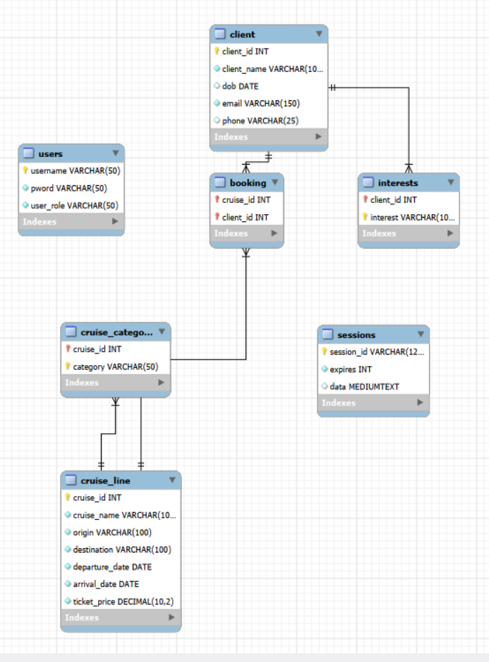

# DB_FinalProject
# CSC351 Database Management Systems
This markdown is a rough outline of our project. It will include overall functionality, how to run it, and a description of how it works. <br/>

## Project Overview
The project simulates a website that might be used by a travel agency and is meant to manage their cruise bookings. The project
hosts a frontend  website and is connected to a backend database.  A user can sign in and make changes, queries, or deletions
to one of our three categories: cruises, clients and bookings. Exactly what a user is allowed to change or delete may depend on the priviledge of certain users.  <br/>
## Project Details
**SQL Backend** - The project is run through a SQL backend which stores the relevant data for the website. There are a total of five tables, and the SQL code is included in the database folder so the frontend can function properly. <br/>

**HTML Frontend** - The website is run through HTML forms that control the aesthetics of the site. The forms are all included in the client folder which includes all relevant HTML code and images used. For relevant inputs, there is client side validation to prevent the user from inputting incorrect information.  <br/>

**JavaScript Connection** - The front and backend are connected with JavaScript and Node. The relevant information is found in the server folder; almost all JS code is contained in the travelAgency file. All user interation on the frontend is controlled by this JS code, which can update, append to, or delete from the database. In this section, we also validate all input on the server side to make sure that users are unable to corrupt our data with bad inputs.  <br/>


## EERD Diagram and Database Design <br/>



## .env File <br/>
In the root direcory, create a file named ".env" with these variables: <br/>
**DB_HOST**: [localhost]<br/>
**DB_USER**: [database username]<br/>
**DB_PASS**: [database password]<br/>
**DB_NAME**: [schema name]<br/>
**SESSION_SECRET**: [generated session secret]<br/>


## Example Run:  <br/>
PS C:\Users\nzywa\DB_FinalProject> cd server  <br/>
PS C:\Users\nzywa\DB_FinalProject\server> node travelAgency.js  <br/>

In a web browser:  <br/>
Go to http://localhost:3000/home  <br/>


## Process of the program

**Server bootup** - Server starts and user is automatically directed to login page on port:3000  <br/>

**Authentication** - User authentication is checked vs preset users in the database  <br/>

**Search** - Users set the parameters that they want to search for and the JS code queries the database for it. Includes partial searches in most cases  <br/>

**Add** - Users can add a cruise, client, or a booking. Submitting an addition will append to the SQL database and be included in future queries.  <br/>

**Update** - Users can modify information that is already in the database. They can change any information they want and unedited info will remain unchanged.  <br/>

**Delete** - Users can delete information from the database which will be reflected in future queries. <br/> 

**Session Tracking** - Anywhere between these steps, if the user navigates away from the website without logging out, the session will be stored.  <br/>

**Log Out** - Users log out from the website. This will be stored, so users will not be able to redirect themselves back into the website unauthenticated.  <br/>


## File Structure <br/>
```
└── 📁DB_FinalProject❗              root
    └── 📁client
        └── 📁bookings❗             contains bookings subpages
            ├── bookingAdd.html
            ├── bookingChange.html
            ├── bookingDelete.html
            ├── bookings.html
            ├── bookingSearch.html
        └── 📁clients❗              contains client subpages
            ├── clientAdd.html
            ├── clientDelete.html
            ├── clients.html
            ├── clientSearch.html
            ├── clientUpdate.html
        └── 📁cruises❗              contains cruises subpages
            ├── cruiseAdd.html
            ├── cruiseDelete.html
            ├── cruises.html
            ├── cruiseSearch.html
            ├── cruiseUpdate.html
        └── 📁images❗               contains all images
        ├── formPageStyling.css
        ├── ❗login.html❗           login landing page
        ├── pageStyling.css
        ├── ❗travelAgency.html❗    travel agency landing page
    └── 📁database❗                 contains database connection + creation
        ├── mysql.js
        ├── tableCreation.sql
    └── 📁server❗                   contains Node server
        ├── travelAgency.js
    ├── .env
    ├── .gitignore
    ├── DBMS - Final Project Report.pdf
    ├── EERD.png
    ├── README.md
    └── requirements.txt
```
